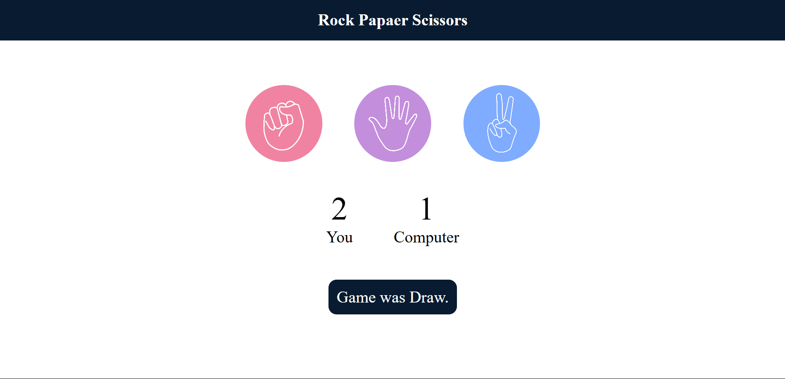

# 🪨 Rock Paper Scissors Game ✂️

A simple interactive **Rock Paper Scissors** game built using **HTML, CSS, and JavaScript**. The user plays against the computer, and the winner is decided based on classic game rules.

## 📸 Preview

### 🟢 Game Start

### ✅ User Wins

### ❌ User Loses

### 🤝 Draw Match

## 🎮 Features

- Click-based game interface
- Real-time score tracking
- Random computer choice generation
- Dynamic result messages and color updates
- Responsive design

## 🛠️ Tech Stack

- **HTML5** – for structure  
- **CSS3** – for styling  
- **JavaScript** – for game logic and interactivity

